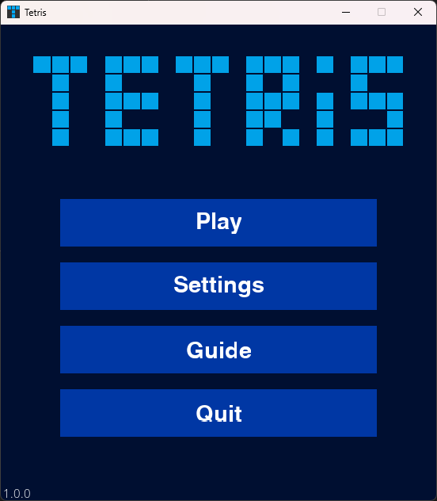
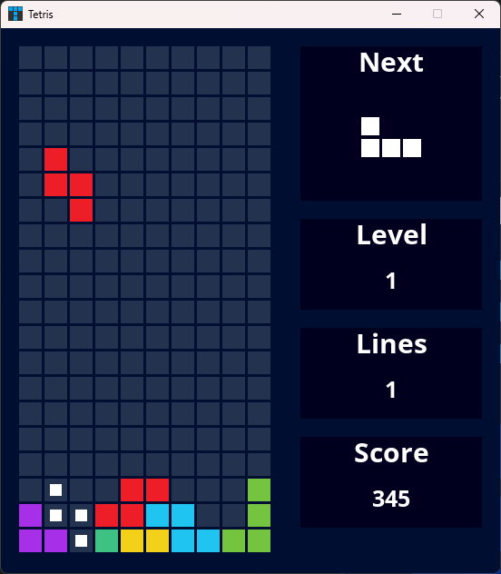

# Tetris Game

## Table of Contents

- [About](#about)
- [Features](#features)
- [System Requirements](#system-requirements)
- [Installation](#installation)
- [Controls](#controls)
- [Menu Navigation](#menu-navigation)
- [Screenshots](#screenshots)
- [License](#license)

## About

This is a C++ **Tetris** game project built using the SDL2 library with additional dependencies such as SDL_img, SDL_ttf, and SDL_mixer for graphical, font, and sound support. The game includes a main menu, settings menu, gameplay interface, and a guide menu. It also features few settings for customization.

## Features

* **Main Menu**: Start the game, access settings, or navigate to the guide.
* **Settings Menu**:
    * **V-Sync On/Off**: Enable or disable vertical synchronization.
    * **Color Blocks On/Off**: Enable or disable colored blocks on the Tetris grid.
    * **Music On/Off**: Toggle background music on or off.
    * **Sound Effects On/Off**: Enable or disable sound effects.
* **Guide Menu**:
    * **Controls**: Learn how to play the game (move blocks, rotate, etc.).
    * **Score Values**: Display the point system and line clearing values.
* **Gameplay**:
    * **Tetris Features**: Side-moving, soft and hard drops, and clockwise/counter-clockwise rotation.
    * **Score Tracking**: Track your score, the number of cleared lines, and the current level.
    * **Leveling**: The level starts from 1 and increases every 10 lines cleared, up to a maximum of 100.

## System Requirements

* **Operating System**: Windows (Tested on Windows 11)
* **Libraries**:
    * [SDL2](https://www.libsdl.org/) (2.30.12 version)
    * [SDL_img](https://github.com/libsdl-org/SDL_image) (2.8.5 version)
    * [SDL_ttf](https://github.com/libsdl-org/SDL_ttf) (2.24.0 version)
    * [SDL_mixer](https://github.com/libsdl-org/SDL_mixer) (2.8.1 version)
    * [nlohmann/json](https://github.com/nlohmann/json) (3.11.3 version)

## Installation

### Option 1: Install Portable Version

1. **Download the Portable Archive**:
    - Go to the *Releases* section of the repository.
    - Download the latest `.zip` archive.

2. **Extract the Archive**:
    - Extract the `.zip` file to your preferred location.

3. **Run the Game**:
    - Navigate to the extracted folder and run `Tetris.exe`.

### Option 2: Build from Source

1. **Clone the Repository**:
    * Clone using terminal with `git clone` command, GitHub, or GitHub Desktop.
2. **Set Up the Project**:
    * Open the `Tetris.sln` file in Visual Studio 2022.
    * Ensure that the necessary SDL2 libraries and additional dependencies (SDL_img, SDL_ttf, SDL_mixer) are properly set up in the project configuration. Use [Lazy Foo' Productions](https://lazyfoo.net/tutorials/SDL/01_hello_SDL/windows/msvc2019/index.php) (for SLD2, SDL_img, SDL_ttf, and SDL_mixer) tutorial to install them properly. nlohmann/json is already included in the project.

3. **Build the Project**:
    * Build the solution using Visual Studio 2022.

4. **Run the Game**:
    * After building the project, you can run the game from within Visual Studio or from the compiled executable.

## Controls

* **Arrow Right and Arror Left**: Move the block (left, right);
* **Arrow Up**: Rotate clockwise;
* **Arrow Down**: Soft drop the piece;
* **Z**: Rotate counter-clockwise;
* **SPACE**: Hard drop the piece;
* **ESCAPE**: Pause the game.

## Menu Navigation

- **Main Menu**: Start game, settings, or guide.
- **Settings**: Adjust v-sync, color blocks, music, and sound effects.
- **Guide**: Learn controls and score values.

## Screenshots

## License

[MIT License](LICENSE)
